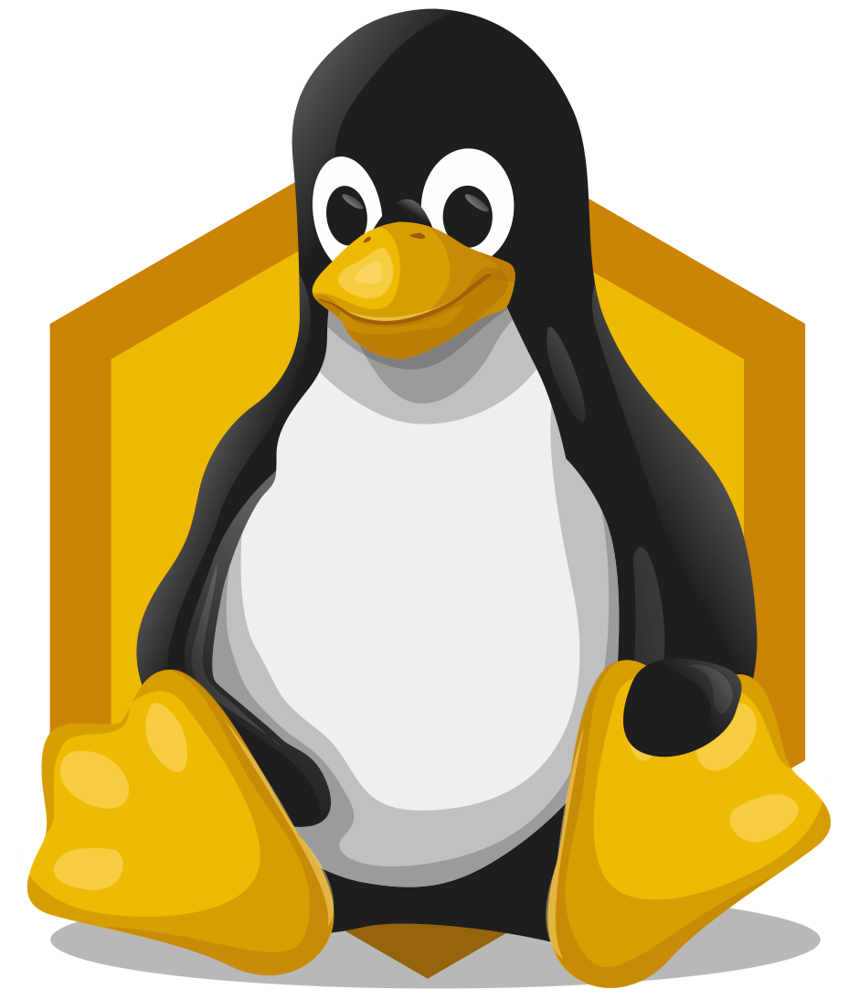
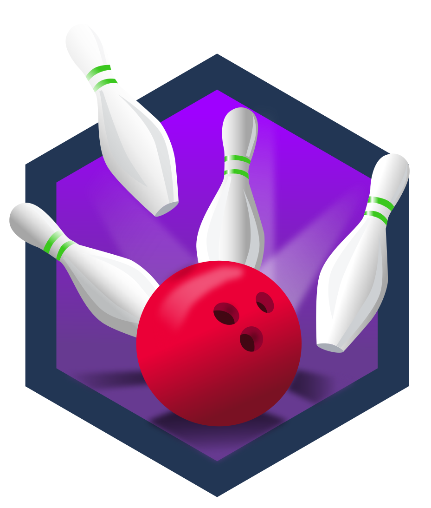

# 🛡️ Cybersecurity Portfolio – Rute Alves

## 👩‍💻 About Me
IT professional with 14+ years of experience in software development, project management, and IT leadership. Currently transitioning into Cybersecurity with a focus on hands-on learning and continuous improvement.

## 🎓 Certifications & Courses
- [CS50’s Introduction to Cybersecurity – HarvardX](https://cs50.harvard.edu/cybersecurity/)
- TryHackMe:
  - [Linux Fundamentals Part 1](https://tryhackme.com/) 🏅 `cat linux.txt` badge
  - [Network Fundamentals](https://tryhackme.com/) 🏅 `First Four` badge
- French A1 – FUN-MOOC (in progress)

## 🔐 Labs & Technical Practice

### TryHackMe – Linux Fundamentals Part 1
- **What I learned**: Basic Linux commands, file structure, permissions
- **Tools**: Terminal (Linux), TryHackMe platform
- **Badge**: `cat linux.txt`
- _[View my TryHackMe profile](https://tryhackme.com/p/atomant78)_

### TryHackMe – Network Fundamentals
- **What I learned**: IP, DNS, firewalls, and basic network protocols
- **Tools**: Wireshark, packet analysis, theoretical labs
- **Badge**: `First Four`
- _[View my TryHackMe profile](https://tryhackme.com/p/atomant78)_

## 🏅 TryHackMe Progress

🔗 [View badge on TryHackMe](https://tryhackme.com/atomant78/badges/first-4-rooms)

## 🛠️ Skills

| Area            | Tools & Technologies                             |
|-----------------|--------------------------------------------------|
| OS              | Ubuntu, Windows Server                           |
| Programming     | PHP (advanced), Java, Python, C# (basic level)   |
| Cybersecurity   | TryHackMe, Wireshark, Nmap (in progress)         |
| Languages       | Portuguese (native), English (advanced), French (A1 - learning) |

---
markdown

---
  
[Veja no TryHackMe](https://tryhackme.com/atomant78/badges)

_This portfolio is constantly evolving as I continue my transition into cybersecurity._
